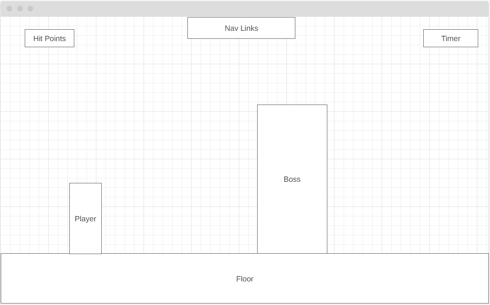

# Shallow-Knight
<h1 align="center">Shallow-Knight</h1>

## Background:
Welcome to the "Shallow-Knight" project! This 2D game draws inspiration from the beloved indie game "Hollow Knight." While my game won't match the complexity and depth of the original, it aims to capture the essence of Hollow Knight's combat system. As the player, you'll venture through three levels, engaging in intense battles with formidable bosses. You'll have a limited number of lives to test your skills and defeat these tough adversaries.

## Functionality & MVPs
In Shallow-Knight, users will be able to:

+ **Player Character Controls:** 
   Responsive and intuitive controls for movement, jumping, and attacking, mirroring the fluidity of Hollow Knight's gameplay.
+ **Boss Battles:**
   - Face off against three unique bosses, each with its own set of attack patterns and phases, designed to test your combat skills.
+ **Health and Lives System:**
   - Manage your character's health, and be prepared for a challenging experience where you'll have 3 lives to conquer the bosses.
+ **Speedrun Timer:**
   - A built-in timer stopwatch to keep track of the time taken to defeat each boss for speedrun purposes.

In addition, this project will include: 
+ **Basic Art and Graphics:**
   - While not as detailed as the original, you can expect simple 2D art and animations for characters, bosses, and the game world.
+ **Minimal Sound and Music:**
   - Enjoy a basic soundtrack and essential sound effects to enhance your gameplay.

## Wireframes

## Technologies, Libraries, APIs 
This project will be implemented with the following technologies:
+ Vanilla Javascript for all logic
+ Vanilla JS DOM manipulation for changing page elements
+ Canvas: to help me draw my game on the screen 
+ Howler.js to control sound effects
+ CSS organization page animations
+ Phaser

## Implementation Timeline
NB:
+ Friday: 
   + Setup project, including webpack configuration.
   + Get the canvas to show up on the screen.
   + Familiarize yourself with the Canvas API.
   + Create PlayerCharacter and Boss classes.

+ Afternoon & Weekend: Continue working on the project.
   + Spend time getting comfortable with the Canvas API.
   + Develop the logic to render a grid on the canvas reflecting the initial state of the player and AI.

+ Monday: 
   + Dedicate this day to implementing the underlying logic of Shallow Knight.
   + Focus on core game mechanics and interactions.

+ Tuesday: 
   + Work on refining the game mechanics and adding additional features.
   + Debug and test the game thoroughly to ensure it functions as intended.

+ Wednesday: 
   + Implement user controls to allow players to interact with the game.
   + Focus on styling, including CSS and design elements.
   + Implement different color schemes and navigation links.
   + If time permits, start working on an

+ Thursday Morning: 
   + Deploy the project to GitHub Pages to make it accessible to others.
   + If you have time, rewrite your project proposal as a production README.
   + Double-check that everything is working correctly and make any necessary last-minute adjustments before sharing your project.

   

## Resources
### Images
<a href="https://www.flaticon.com/free-icons/mute">Freepik</a>
<a href="https://darkpixel-kronovi.itch.io/">Character Sprites by Kronovi-</a>
<a href="https://craftpix.net/freebies/free-mountain-backgrounds-pixel-art/?num=1&count=42&sq=mountain&pos=8">Background by CraftPix-</a>

### Music
<a href="https://karlcasey.bandcamp.com/track/torn-flesh">Torn Flesh by Karl Casey</a>

### Inspiration
<a href="https://www.youtube.com/@Frankslaboratory">Franks laboratory</a>
<a href="https://www.youtube.com/@ChrisCourses">Chris Courses</a>